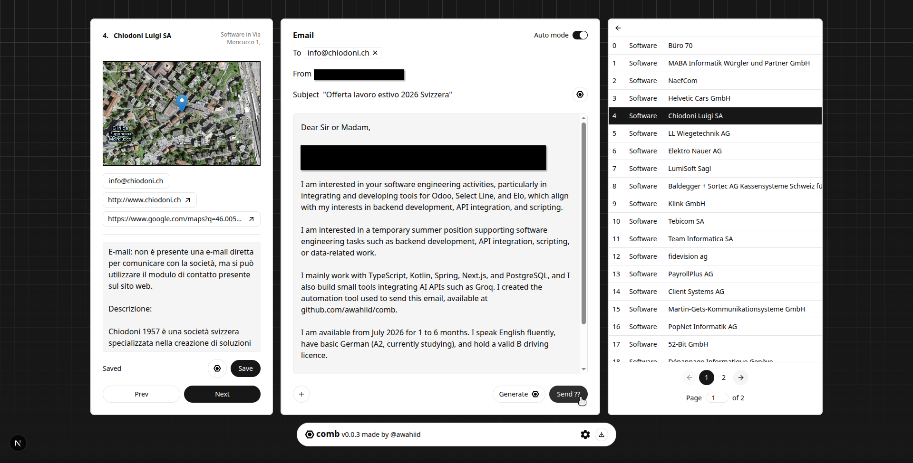
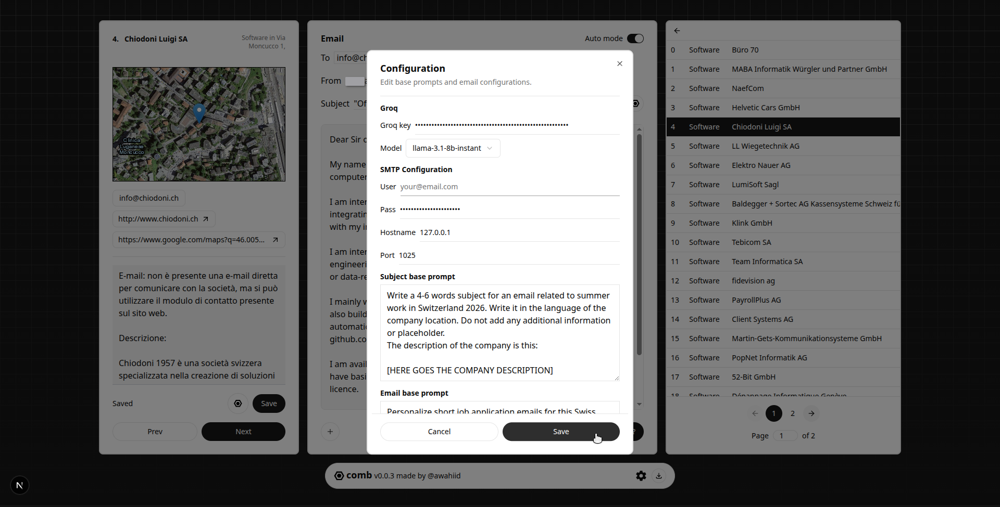

  

# Comb
Electron–Next.js desktop application for automated email outreach. It loads company data from CSV files, processes each entry, and uses the Groq API to generate personalized emails before sending them automatically.

> Created by @awahiid

Copyright (C) 2026 Abdel Wahed Mahfoud Mouhandizi
SPDX-License-Identifier: AGPL-3.0-or-later